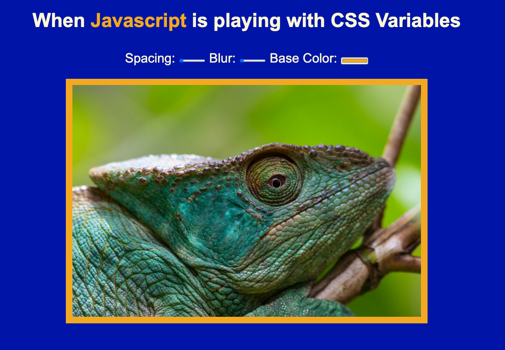

# :art: CSS Variables 

## Create an interface that allows you to play with css variables using javascript.

## Illustration

## Language
- html5
- css3
- javascript vanilla

## Goals 
- DOM & interface

## Status
Project completed

## Context
Project carried out during my training as a web developer